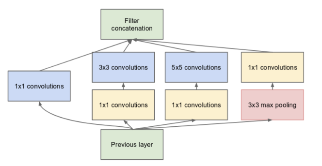
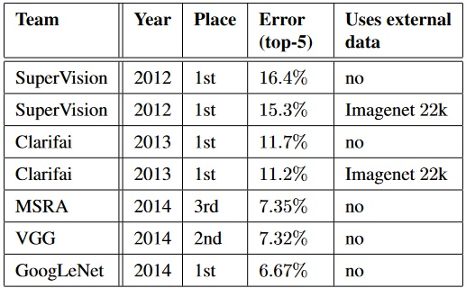
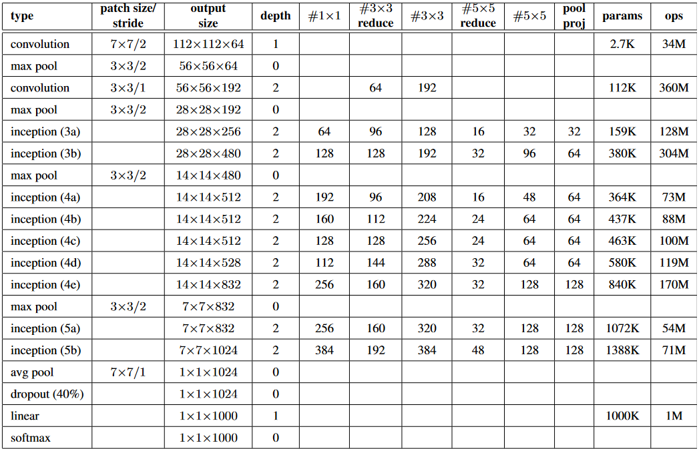

# GoogleNet(Inception Networks)

We use and explain InceptionV1(GoogLeNet) architecture in this repository

## Inceptions

The Inception Network was one of the major breakthroughs in the fields of Neural Networks, particularly for CNNs.  
So far there are three versions of Inception Networks, which are named Inception Version 1, 2, and 3. The first version entered  
the field in 2014, and as the name "GoogleNet" suggests, it was developed by a team at Google. This network was responsible for  
setting a new state-of-the-art for classification and detection in the ILSVRC. This first version of the Inception network is  
referred to as GoogleNet.

## GoogLeNet

The GoogleNet Architecture is 22 layers deep, with 27 pooling layers included. There are 9 inception modules stacked linearly in total. 
The ends of the inception modules are connected to the global average pooling layer. Below is a zoomed-out image of the full GoogleNet architecture. 

## GoogLeNet Training and Results

GoogleNet is trained using distributed machine learning systems with a modest amount of model and data parallelism. The training  
used asynchronous stochastic gradient descent with a momentum of 0.9 and a fixed learning rate schedule decreasing the learning  
rate by 4% every 8 epochs. Below is an image of the results of the teams that performed for ILSVRC 2014. GoogleNet stood in first  
place with an error rate of 6.67%.

The detailed architecture and parameters are explained in the image below:

# Datasets

- In this project we use [ImageNet2012](https://www.image-net.org/download.php).

- And we use [oxford_iiit_pet](https://www.tensorflow.org/datasets/catalog/oxford_iiit_pet) dataset from tensorflow: 
  The Oxford-IIIT pet dataset is a 37 category pet image dataset with roughly 200 images for each class.  
  The images have large variations in scale, pose and lighting. All images have an associated ground truth annotation of breed.

# Installation

1. Install python

- requirement version 3.x **x = {7,8,9, 10}**

2. Create virtual environment

- pip install virtualenv
- python -m venv {name of virtual environment}
- activate it 
- 1. On Windows: C:/path to your env/Scripts/activate
- 2. On Linux: path to your env/bin/activate

3. `pip install -r requirements.txt`

# Features

### Deep Learning

- architectures are built using [tensorflow](https://github.com/tensorflow/tensorflow.git)
- run in colab 
